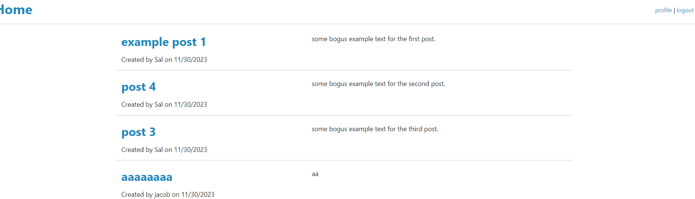
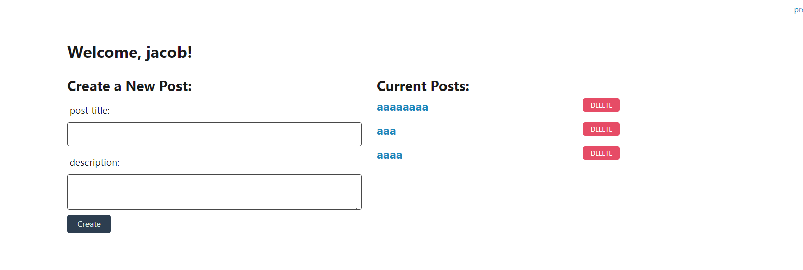

# Title: jh-products_db

# Table of Contents:

- [Description](#description)
- [Installation](#installation)
- [Usage](#usage)
- [Contributions](#contributions)
- [Questions](#questions)

## Description

blog website that creates posts, comments, users, can't quite update posts yet.
more to come
## Installation

Install mysql.
Install node js.
Copy the code from github.
open server file in terminal.
run npm i make sure you have all the packages you need. listed in the package.json file.

## Usage

open mysql in terminal using mysql -u "yourUsername" -p "yourPassword"
in terminal run the schema file a using SOURCE db/schema.sql.
create and adjust a .env file so the application will function properly.
.env file should look like this :
DB_NAME='db_name'
DB_USER='username'
DB_PASSWORD='userpassword'.

run the seeds file using node seeds/seed.js

now we can navigate to our server file and run our server using npm run start in the terminal.

navigate to localhost3001 to test the website

## Contributions

Class assignments, w3 schools for object deconstruction, stack overflow articles for help with model structure and attributes.

## Questions

https://github.com/lilcobby

